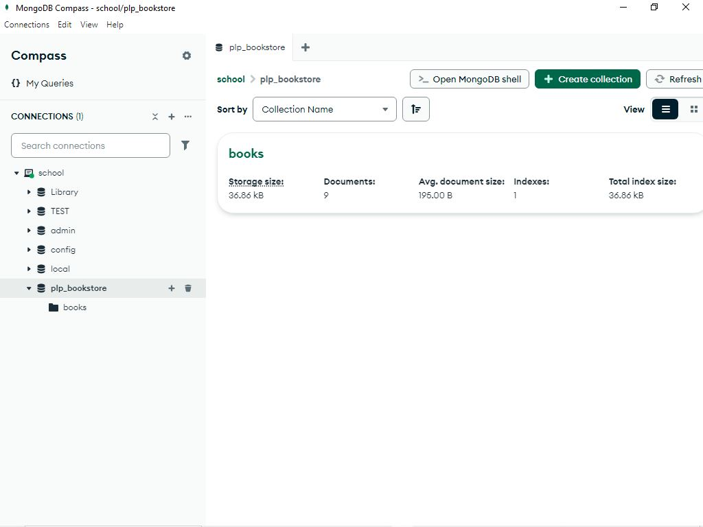
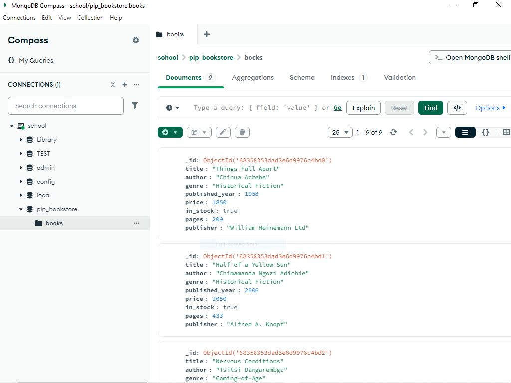
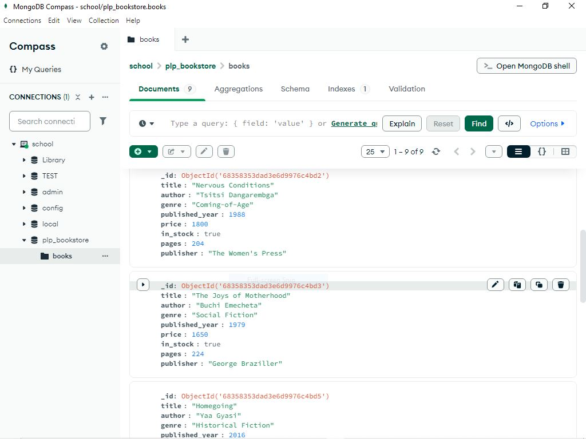
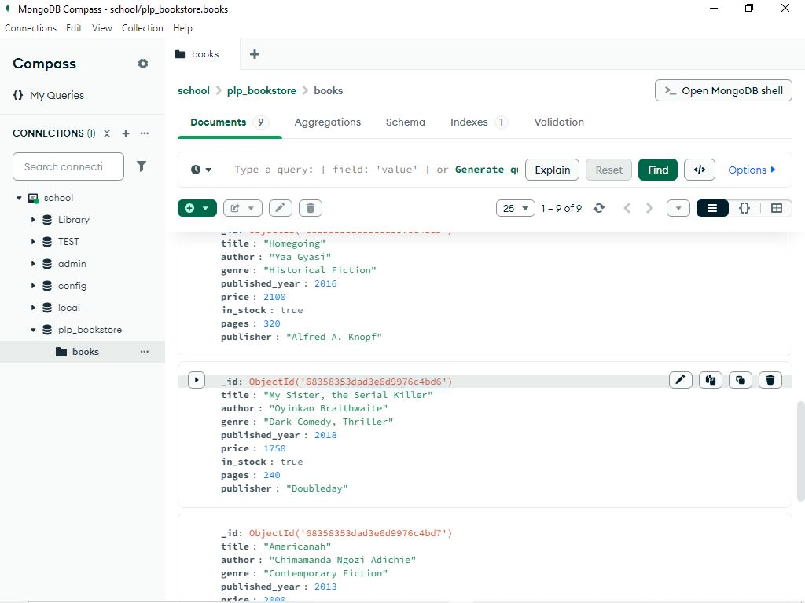
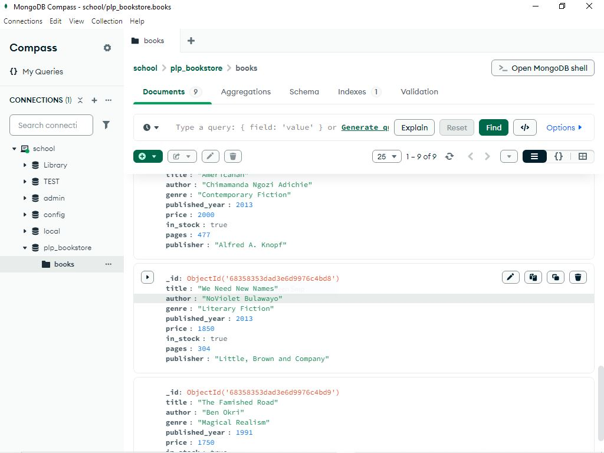

# MongoDB Assignment

This repository contains scripts and queries for the Week 1 MongoDB Fundamentals Assignment.

## How to Use

1. **Start your MongoDB server** (locally or via MongoDB Atlas).

2. **Populate the Database**  
   Run the [`insert_books.js`](insert_books.js) script to insert sample book data into your database:
   ```sh
   node insert_books.js
   ```
   This script will connect to your MongoDB instance and populate the `plp_bookstore` database with sample data.

3. **Run the Queries Using mongosh**  
   - Open your MongoDB shell by running:
     ```sh
     mongosh
     ```
   - Switch to the `plp_bookstore` database:
     ```
     use plp_bookstore
     ```
   - Open the [`queries.js`](queries.js) file, copy its contents, and paste them directly into the `mongosh` shell to execute the queries and aggregation pipelines.

## Requirements

- MongoDB installed locally or access to a MongoDB Atlas cluster
- Node.js (for running `insert_books.js`)
- MongoDB Shell (`mongosh`)

## Notes

- Before running the queries, make sure your database is populated using [`insert_books.js`](insert_books.js).
- All queries in `queries.js` are intended to be run in the `mongosh` shell.
- You can modify the queries as needed for your own testing.

## Contents

- **insert_books.js**: Script to insert sample book data into MongoDB.
- **queries.js**: Contains all required MongoDB queries and aggregation pipelines (to be run in `mongosh`).
- **screenshots/**:  
  - 
  - 
  - 
  - 
  - 

---

For more details, see the [Week1-Assignment.md](Week1-Assignment.md) file.